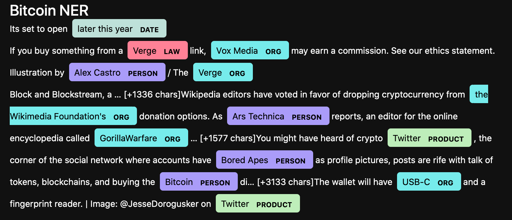
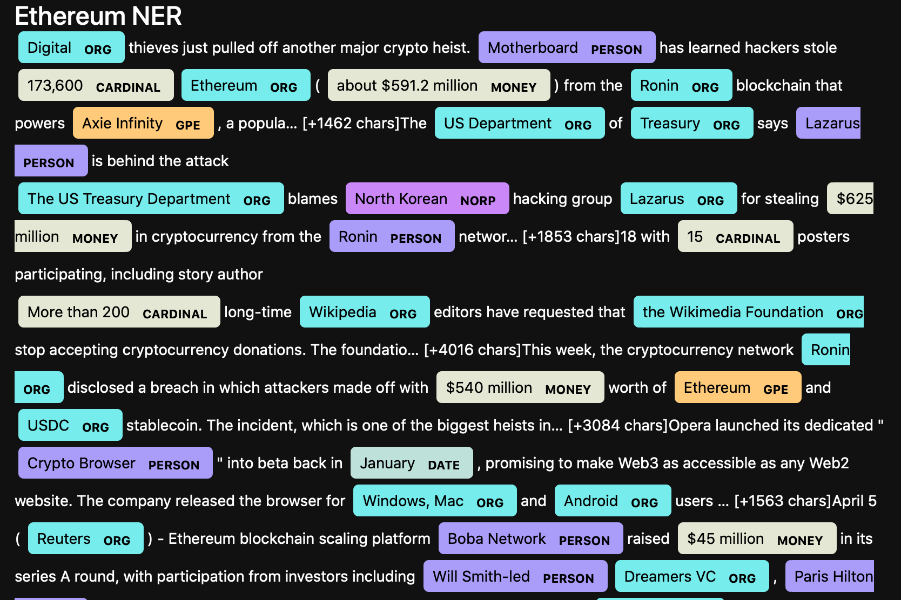

# Tales from the Crypto

## Background
---
There's a lot of hype in the news about cryptocurrency, so we want to take stock of the latest news descriptions regarding Bitcoin and Ethereum to get a better feel for the current public sentiment around each coin.

In this project, I have applied natural language processing to present the sentiment in the latest news articles about Bitcoin and Ethereum. I have also applied fundamental NLP techniques such as common words and phrases and organizations and entities mentioned in the articles.

### API and Libraries Used:
* News API
* nltk and spaCy NLP libraries

---
# N-Grams Frequency Analysis

## Bitcoin - Top 10 frequent bigrams
 ('char', 20),
 ('Bitcoin', 10),
 ('million', 6),
 ('bitcoin', 6),
 ('world', 5),
 ('Reuters', 5),
 ('Block', 4),
 ('cryptocurrency', 4),
 ('company', 4),
 ('April', 4)

## Ethereum - Top 10 frequent bigrams
('char', 20),
 ('Ethereum', 7),
 ('cryptocurrency', 7),
 ('April', 5),
 ('year', 5),
 ('million', 4),
 ('Reuters', 4),
 ('crypto', 3),
 ('Ronin', 3),
 ('blockchain', 3)
 
# Wordclouds
Wordclouds help present the most common words throughout the texts analyzed. When working through the analysis, it is also a helpful tool for identifying frequent stopwords that are not included in NLTKs standard stopwords module.

## Bitcoin

## Ethereum

# Named Entity Recognition
---

---
---
